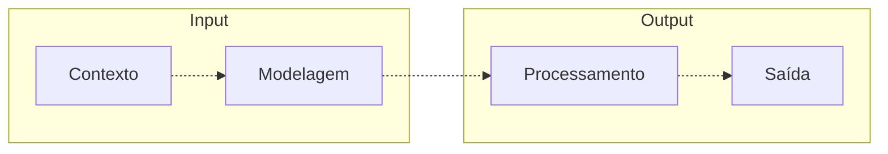

# Seja bem-vindo(a)

Olá **Dev**, **Tech Recruiter** e **entusiasta do código**!

Sou o **Thiago Cajá**, me aventurando na área de **Tecnologia desde 2007**.

Essa aqui é a minha rede social favorita de longe! Olha esse monte de código da galera 😀. 

Se você me perguntar quais são meus valores, vou te contar no ato: `humilde`, `trabalhador`, `sincero` e `dedicado`.

Meu propósito de vida é ajudar. Percorro esse caminho via TI, consertando e construindo coisas.

>[!NOTE]
> Em tempos de **IA**, pratique a **IE (Inteligência Emocional)**.
>
> Use o **pensamento crítico** para tomar melhores decisões, tendo como base **dados** e **fatos** concretos.

Ultimamente faço um `dump` dos pensamentos, escrevendo no meu [blog](https://thiagocaja.dev).

  
Você quer mais detalhes? Claro, é só clicar aqui ⬇️.

 
## Stack de Trabalho

Meu foco atualmente está sobre a stack **.NET**. Em conjunto, tenho estudado Web Moderno com **React** e quero me tornar um **Arquiteto de Soluções**.

### Planejamento e Arquitetura
- **Modelagem de domínio**, organização em camadas e aplicação de boas práticas (SOLID, Clean Architecture)  
- **Adoção de práticas de segurança**, com atenção à exposição de dados e validações  

### Backend e Integrações
- **Minimal APIs** para construção de APIs enxutas e performáticas  
- **ASP.NET** em soluções web robustas com foco em APIs e rotas segmentadas  
- **Banco de dados** com SQL Server, utilizando procedures, views e queries otimizadas  
- **Integração com APIs externas** e consumo de serviços REST  
- **Migração e sustentação de sistemas existentes**, com foco em estabilidade e modernização  
- **Windows Forms** para manutenção e evolução de sistemas desktop legados  

### Frontend
- **Blazor** (WebAssembly e Server) para aplicações modernas e interativas  
- **Razor Views** para construção de interfaces dinâmicas e integração com dados da API  

### Testes e Qualidade
- **Testes automatizados** (unitários e integrados) para garantir confiabilidade  
- **Atenção à performance e experiência do usuário**, evitando complexidade desnecessária  

### Publicação e Versionamento
- **Versionamento e automações de deploy** com Git e GitHub Actions

## Filosofia

Acredito que o **equilíbrio é a chave** para soluções eficazes ⚖️.  
O básico funciona — e tudo começa com **planejamento e arquitetura**.

## Fluxo de Desenvolvimento

Encaro o desenvolvimento como um processo estruturado:

1. **Entendimento do contexto**: Qual problema estamos resolvendo?  
2. **Modelagem das entradas (inputs)**: Organização e estruturação das informações  
3. **Processamento e entrega das saídas (outputs)**: Clareza, eficiência e propósito

## Produtividade com Inteligência Artificial Generativa

Utilizo IA como uma **ferramenta prática e estratégica** para acelerar meu fluxo de trabalho — com foco em produtividade, qualidade e organização.

- Faço uso do **ChatGPT**, com **prompts otimizados** para documentação, revisão de código, análise de logs, estruturação de ideias e automação de tarefas repetitivas.  
- Complemento com ferramentas como **NotebookLM / Gemini**, **DeepSeek** e outros recursos de IA para gerar insights, documentações visuais, esquemas e testes.  
- Sempre com **curadoria humana, senso crítico e responsabilidade** — IA me ajuda a ganhar tempo, mas **não substitui a análise técnica nem a tomada de decisão**.

## Boas Práticas

Procuro aplicar uma **modelagem limpa**, com **boas práticas** e nomes expressivos para classes, propriedades e métodos.

# Aprendizado Contínuo

Me mantenho atualizado com os conteúdos do [curso.dev](https://curso.dev) e [balta.io](https://balta.io).

Sou um eterno aprendiz e gosto de compartilhar o que descubro.

Eu compartilho mesmo 🙂! Veja aqui dicas pra personalizar seu perfil ⬇️.

 

- [Escudos de tecnologia](https://shields.io/)
- [Estatísticas e cards personalizados](https://github.com/anuraghazra/github-readme-stats)
- [Troféus, PacMan, Snake e outros](https://profile-readme-generator.com/)

**Posso ajudar em algo?** É só chamar.
  

# 📫 Contact

# 💻 Stack

# 🧠 Generative AI

# 🛠️ Tools

# 🎨 Themes 

# 📈 Stats

  

 

  

  

  

<picture>
  <source media="(prefers-color-scheme: dark)" srcset="https://raw.githubusercontent.com/thiagocajadev/thiagocajadev/output/pacman-contribution-graph-dark.svg">
  <source media="(prefers-color-scheme: light)" srcset="https://raw.githubusercontent.com/thiagocajadev/thiagocajadev/output/pacman-contribution-graph.svg">
  
</picture>

# 📌 Pinned

