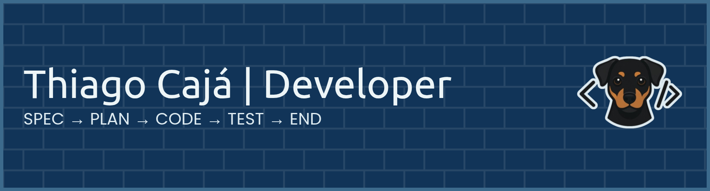
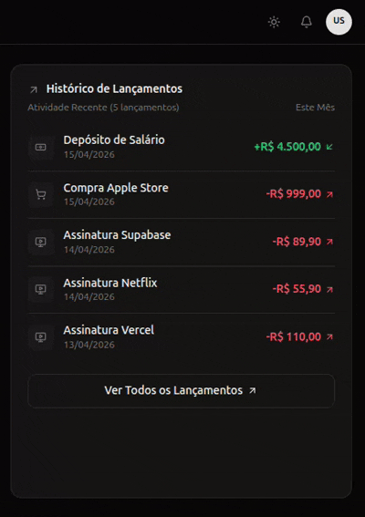

# Seja bem-vindo(a) 

[**🇺🇸 English Version**](docs/md/en/README.en.md)

Olá **Dev**, **Tech Recruiter** e **entusiasta do código**!

Sou o **Thiago Cajá**. Comecei na Tecnologia em **2007**, passando pelo suporte técnico e administração de servidores. Foi criando meus primeiros scripts `.bat` para automatizar tarefas repetitivas que entendi o valor de ganhar tempo e eficiência. Desde então, busco sempre por melhoria contínua.

Explorei diferentes linguagens, como Java, VB e PHP, até me firmar no ecossistema **.NET (C#)**. Liderar um time de suporte (**Helpdesk**) me ensinou algo que levo até hoje: raramente o computador ou o sistema é todo o problema. O código é uma ferramenta para resolver dores de pessoas reais e manter os processos funcionando.

Hoje, utilizo uma **stack moderna** (**.NET**, **React**, **Docker**, **Postgres**) unindo a solidez da engenharia de software com a agilidade do mundo **AI-Native**. Minha meta é construir sistemas robustos e seguros, sempre buscando simplificar e facilitar a rotina de desenvolvedores e usuários.

Eu nunca vou saber todas as respostas, mas sei pesquisar e buscar alternativas. Meu propósito é **Resolver Problemas**.

> [!IMPORTANT]
> **"Evite o complexo, prefira o simples e sofisticado"**

[](mailto:contato@thiagocaja.dev)

<details>
<summary><b>💼 Conheça meu trabalho</b></summary>

### Projetos de portfólio

Confira como desenvolvo aplicações completas, aplicando **checklists de segurança e compliance**:

- [Frontend Showcase](https://fs.thiagocaja.dev) → Telas modernas, limpas e responsivas, buscando a melhor experiência para o usuário.

- [Backend Showcase](https://bs.thiagocaja.dev) → Melhores práticas em APIs, servindo dados de forma segura para o frontend e mobile.

- [Meu time joga](https://meutimejoga.org) → Chat IA especialista em futebol, além de dados e estatísticas de clubes e seleções.

- [Spec-Driven Guide](https://specdrivenguide.org) → Guia de Desenvolvimento Orientado por Especificações para trabalhar com IA.

- [Code Style](https://thiagocajadev.github.io/code-style) → Meu estilo de escrever e manter códigos.

- [Thiago Cajá Desenvolvedor](https://thiagocaja.dev) → Site pessoal, apresentando meu portfólio e blog.

---

</details>

<details>
<summary><b> 📖 Um pouco mais sobre mim</b></summary>

### Meus valores

Valores que guiam minha jornada: **Humildade**, **Trabalho**, **Sinceridade** e **Dedicação**.
<br>

Essa aqui é a minha "rede social" favorita de longe! Mais códigos e menos papo furado 😄.
<br>

Meu propósito de vida é ajudar. Percorro esse caminho via TI, consertando e construindo coisas.
<br>

> **"Em tempos de IA, pratique a IE (Inteligência Emocional)."**
>
> A Inteligência Artificial é uma ferramenta incrível e te amplifica, mas as decisões devem ser tomadas com base em dados e não achismos.

Está começando a utilizar a metodologia SDD (Spec-Driven Development) nos projetos? Esse guia pode te ajudar [specdrivenguide.org](https://specdrivenguide.org). Venha fazer parte!
<br>

Ultimamente faço um `dump` de pensamentos, escrevendo no meu [blog](https://thiagocaja.dev).

---

</details>

<details>
<summary><b> 🎨 Pensamento de Design UI/UX</b></summary>

### Arquitetura visual

> "Desenhe a solução. Tem que ser fácil de usar."

Antes de qualquer linha de código, penso na interface com **empatia técnica**: foco em produtividade para quem desenvolve o frontend e usabilidade real para quem usa o produto.

Uso o **Design Thinking** para definir o que importa. Mantenho o escopo sob uma hierarquia clara e funcional:

| Categoria       | Tokens e elementos                                                          |
| :-------------- | :-------------------------------------------------------------------------- |
| **Fundamentos** | Mobile/Desktop first · Cores · Tipografia · Espaçamentos · Sombras · Bordas |
| **Assets**      | Ícones · Imagens · Vídeos · Áudio · Documentos                              |
| **Interface**   | Links · Botões · Formulários · Tabelas · Gráficos · Mapas                   |

### Sistema de temas (Light & Dark)

A alternância de temas exige controle rigoroso de contraste para evitar fadiga visual. Aplico o conceito de <b>superfície + luminância</b> para garantir profundidade.

> Cada elemento vive em uma profundidade. Componentes que ficam "dentro" de outros sobem de nível e ganham mais <b>luminância</b> (brilho percebido), preservando a cor base. Isso mantém a naturalidade tanto no modo claro quanto no escuro.



### Estilização

O cuidado com os detalhes define a retenção. Uso Tailwind CSS, Shadcn UI e Lucide para criar interfaces que pareçam atuais e profissionais. Estética atualizada aumenta a adoção do sistema.

- Fluxos que guiam o usuário de forma intuitiva até o objetivo.
- Equilíbrio entre densidade visual e respiro (whitespace).
- Grid e espaçamentos padronizados.
- Divisão lógica de conteúdo (steps, tabs, modais).

### Anti-padrões (UI/UX)

Experiência ruim é custo de suporte e churn. Alguns pontos que trato como red flags:

- <b>Excesso de informação</b>: Telas sobrecarregadas que confundem o foco.
- <b>Tabelas densas</b>: Listas longas sem paginação, filtros ou busca.
- <b>Poluição visual</b>: Cores vibrantes em excesso ou falta de contraste.
- <b>Animações decorativas</b>: Movimentos que não comunicam estado ou feedback.
- <b>Rigidez</b>: Uso de pixels fixos onde o layout deveria ser fluido.
- <b>Viés de plataforma</b>: Projetar pensando apenas em um ecossistema (Apple/Android).

Esses são alguns dos detalhes com que me importo, mantidos curtos para a seção seguir legível. Se quiser falar de código, siga para o próximo tópico.

---

</details>

<details>
<summary><b> 👨🏻‍💻 Vamos falar de código</b></summary>

### Código narrativo

> "Código bom é aquele que conta a história de forma linear."

Tem que seguir a narrativa, mostrando passo a passo o que está acontecendo. Aplicações são feitas para resolver problemas, então o código deve refletir isso.

Programar é a última etapa. Primeiro, é definido o processo. Depois o planejamento e quais as tarefas a serem executadas, reduzindo a chance de falhas.

> **"Alinhamento de processo é fundamental para o sucesso do projeto."**

`PROCESSO` → `PLANEJAMENTO` → `TAREFAS` → `PROGRAMAÇÃO` → `TESTES` → `ENTREGA`

Se estou atuando em um projeto, preciso pensar em como ele será executado, mantido e evoluído. O próximo desenvolvedor que for atuar deve entender o código sem dificuldade e contar com uma documentação que esclarece as decisões técnicas. Os melhores profissionais são os que **geram valor para o negócio e pessoas**.
<br>

```js
// ✅ Código Narrativo
// Orquestrador no topo, detalhes abaixo (Step-down Rule), densidade visual e nomes expressivos.

// Exemplo simplificado. O código conta a história, sem precisar de comentários.

await realizaVenda(123);

async function realizaVenda(codigoDoPedido) {
  const detalhesDoPedido = buscaPedido(codigoDoPedido);
  if (pedidoInvalido(detalhesDoPedido)) return;

  const notaFiscalEmitida = emiteNotaFiscal(detalhesDoPedido);
  return notaFiscalEmitida;
}

// Detalhes das funções sempre abaixo do fluxo principal

function buscaPedido(codigoDoPedido) {
  const detalhesDoPedido = bancoDeDados.procuraPorCodigo(codigoDoPedido);
  return detalhesDoPedido;
}

function pedidoInvalido(detalhesDoPedido) {
  if (detalhesDoPedido === null || detalhesDoPedido.itens.length === 0)
    return true;

  if (detalhesDoPedido.cliente.inadimplente)
    return notificaInadimplencia(detalhesDoPedido);

  return false;
}

function emiteNotaFiscal(detalhesDoPedido) {
  aplicaDescontos(detalhesDoPedido);

  const notaFiscal = salvaPedido(detalhesDoPedido);
  return notaFiscal;
}
```

O foco do código acima não é aplicação em si, mas sim demonstrar o código narrativo. Vou falar no próximo tópico sobre **anti-padrões** e **padrões** que procuro aplicar nos projetos.

> 👨🏻‍💻 Reuni minhas melhores práticas de estilização de códigos em um repositório dedicado. Caso queira conhecer, acesse [code-style](https://github.com/thiagocajadev/code-style)

---

</details>

<details>
<summary><b>⚠️ Anti-Padrões e Padrões</b></summary>

### Anti-padrões: evite problemas conhecidos

**Anti-padrões** são soluções que parecem razoáveis na hora de escrever e criam trabalho depois, na hora de ler, mudar ou confiar no que está lá. Muitos nascem das limitações de solução e ferramentas de cada época, e quando o mesmo problema reaparece em times e linguagens diferentes, alguém dá um nome a ele.

Abaixo um exemplo do espaguete, seguido das trocas que faço para resolver cada ponto.

```js
// ❌ Versão espaguete do exemplo anterior, com o código todo misturado e sem conceitos.

realizaVenda(123);

function realizaVenda(x) {
  let resultado;
  // nomes ruins
  let p = buscaPedido(x);

  if (p != null) {
    if (p.itens && p.itens.length > 0) {
      if (!p.c.inadimplente) {
        // começa a fazer um monte de coisa no meio
        if (p.total > 100) {
          p.desconto = 10;
        } else {
          p.desconto = 0;
        }

        apply(p);

        function apply(p) {
          if (p.desconto) {
            p.total = p.total - p.desconto;
          }
        }

        let salvo = salvaPedido(p);

        if (salvo) {
          resultado = salvo;

          // lógica aleatória no meio
          if (Math.random() > 0.5) {
            console.log("Log qualquer");
          } else {
            console.warn("Outro log");
          }
        } else {
          resultado = null;
        }
      } else {
        // mais lógica aninhada com função no meio
        notify(detalhesDoPedido);
        resultado = false;

        // nomes ruins e mistura do português com inglês
        function notify(p) {
          console.log("cliente inadimplente", p?.cliente?.nome);
          return true;
        }
      }
    } else {
      resultado = undefined;
    }
  } else {
    resultado = null;
  }

  // código morto/confuso
  if (false) {
    console.log("nunca executa");
  }

  return resultado;

  function salva(p) {
    if (!p) return;
    if (p.total < 0) return null;
    return { ...p, salvo: true };
  }
}
```

### 🚫 Anti-padrões do exemplo, por categoria

No exemplo acima, pra chegar na regra de desconto você desce quatro níveis de `if`. Pra saber o que a função devolve, rastreia as cinco atribuições de `resultado`. A função `salva` no rodapé ninguém chama, e o `Math.random()` troca o log a cada execução. Abaixo, cada linha liga o que está nesse código ao que uso no lugar.

#### Nomes e legibilidade

| No exemplo acima                                             | O que uso no lugar                                         |
| :---------------------------------------------------------- | :--------------------------------------------------------- |
| `x`, `p`, `c`, `apply`: uma letra não diz o que guarda       | `codigoDoPedido`, `detalhesDoPedido`: o nome carrega a intenção |
| `realizaVenda` e `notify` no mesmo arquivo: português e inglês misturados | Um idioma do início ao fim                                 |
| O nome não explica, então sobra um comentário pra explicar   | Nome expressivo, e o comentário some por não ter mais função |

#### Controle de fluxo

| No exemplo acima                                             | O que uso no lugar                                         |
| :---------------------------------------------------------- | :--------------------------------------------------------- |
| Três `if` aninhados escondem a regra no quarto nível         | Cláusula de proteção na entrada, com o sucesso no primeiro nível |
| `p != null` compara com coerção, tratando `null` e `undefined` como iguais | `pedido?.itens ?? []` normaliza o ausente, sem comparação frágil com `null` |
| A decisão da venda repartida entre blocos distantes          | Uma guarda por decisão, na ordem em que acontecem          |

#### Retorno e contrato

| No exemplo acima                                             | O que uso no lugar                                         |
| :---------------------------------------------------------- | :--------------------------------------------------------- |
| Devolve `null`, `undefined`, `false` ou objeto, conforme o caminho | Um formato só, igual em todos os caminhos                  |
| Quem chama testa nulo passo a passo pra deduzir o que houve   | Um `Result` com `status` e `motivo` já responde            |
| `false` não conta por que a venda não saiu                   | O motivo acompanha o desfecho: `CLIENTE_INADIMPLENTE`      |

#### Estrutura e design

| No exemplo acima                                             | O que uso no lugar                                         |
| :---------------------------------------------------------- | :--------------------------------------------------------- |
| Uma função busca, valida, calcula desconto, grava e loga     | Uma responsabilidade por função, um nível de abstração por vez |
| Regra, persistência e log no mesmo bloco                     | Domínio separado da gravação e do efeito colateral         |
| `apply`, `notify`, `salva` soltas no meio do fluxo           | Auxiliares logo abaixo de quem chama, na ordem de uso      |
| `salva` sem chamador e `if (false)` inalcançável             | Apago no commit em que encontro. O git guarda o histórico. |

#### Estado e mutabilidade

| No exemplo acima                                             | O que uso no lugar                                         |
| :---------------------------------------------------------- | :--------------------------------------------------------- |
| `let resultado` reatribuído em cinco pontos                  | `const` por padrão: um valor, atribuído uma vez            |
| `p.total` e `p.desconto` alterados num `p` que veio de fora  | A função devolve o pedido com desconto, sem mexer no original |
| `p.c.inadimplente`: pra saber o que é `c`, abro `buscaPedido` | `detalhesDoPedido.cliente.inadimplente` se lê sem sair do arquivo |

#### Efeitos colaterais e previsibilidade

| No exemplo acima                                             | O que uso no lugar                                         |
| :---------------------------------------------------------- | :--------------------------------------------------------- |
| `console.log` e `console.warn` no meio do cálculo            | Efeito com nome e lugar próprios: `notificaInadimplencia`  |
| `Math.random()` decide o log: mesma venda, saídas diferentes | Regra determinística: mesma entrada, mesma saída           |
| Testar exige rodar o que a função grava e imprime            | Cálculo isolado do efeito, e o teste chama só o cálculo    |

### 🚫 Outros anti-patterns comuns

Fora do espaguete, estes aparecem com frequência. Cada um, sozinho, parece inofensivo, e é por isso que passam na revisão.

#### Modelagem e contrato de dados

| O padrão ruim                                               | O que uso no lugar                                         |
| :---------------------------------------------------------- | :--------------------------------------------------------- |
| `true`/`false` puro como resposta de uma operação de negócio | `Result` estruturado: o desfecho mais o motivo             |
| Tipos de retorno diferentes na mesma função                 | Um formato só                                              |
| Objeto de resultado com campos vazios pra manter a forma (`meta: {}`, `data: {}`) | Só os campos que aquele desfecho preenche                  |
| `Result` carregando `statusCode` de HTTP                    | A regra devolve o desfecho, e a borda traduz em status HTTP |
| Retorno de objeto anônimo, montado diferente em cada chamada | Um formato nomeado, igual em todas                         |

#### UI fazendo o que não é dela

| O padrão ruim                                               | O que uso no lugar                                         |
| :---------------------------------------------------------- | :--------------------------------------------------------- |
| `fetch` escrito dentro do componente                        | A chamada fica em um `apiClient`, o ponto único que conversa com o servidor |
| Chamadas à API espalhadas, cada uma com sua configuração    | Um `apiClient` só, com URL base, cabeçalhos e tratamento de erro |
| Regra de negócio dentro de `useEffect`                      | A regra fica no servidor ou em módulo próprio. O componente exibe. |
| Dados brutos chegando na tela e sendo transformados ali     | Os dados chegam no formato que a tela desenha              |
| `try/catch` repetido em toda tela                           | Erro tratado na borda, uma vez                            |
| Várias fontes de verdade pro mesmo dado no state            | Uma fonte de verdade, e o resto deriva dela               |

#### Design de código

| O padrão ruim                                               | O que uso no lugar                                         |
| :---------------------------------------------------------- | :--------------------------------------------------------- |
| Nomes genéricos: `handle`, `process`, `manage`              | Verbo que diz o que a função faz: `calculaTotal`, `emiteNotaFiscal` |
| Função com mais de uma responsabilidade clara               | Uma responsabilidade por função, e o nome cabe sem “e” no meio |
| A mesma estrutura duplicada entre camadas                   | Regra de três: extraia na terceira ocorrência, não na primeira |
| Cache misturado com a regra de negócio                      | Cache na borda, em volta da regra. A regra é escrita sem citar o cache. |
| Abstração criada pra um caso que ainda não existe           | Escreva quando o segundo caso chegar                      |

#### Fluxo e controle

| O padrão ruim                                               | O que uso no lugar                                         |
| :---------------------------------------------------------- | :--------------------------------------------------------- |
| Exception como fluxo normal, por exemplo lançar erro pra sinalizar “não encontrei” | `null` explícito ou `Result`. Exception fica pro que é erro de verdade. |
| Aninhamento onde caberia um retorno antecipado              | Cláusula de proteção na entrada                           |
| Código morto e trechos inalcançáveis                        | Apague                                                    |

---

### ✅ O mesmo código, reescrito

As escolhas são as da coluna da direita: orquestrador no topo, auxiliares pequenas extraídas logo abaixo na ordem de chamada (regra do degrau, Step-down Rule), densidade visual e nomes que dizem a intenção.

```js
// ✅ Código narrativo
// Orquestrador no topo, auxiliares extraídas abaixo na ordem de chamada
// (Step-down Rule), densidade visual e nomes expressivos.

const VENDA_APROVADA = "APROVADA";
const VENDA_RECUSADA = "RECUSADA";

const venda = await realizaVenda(123);

async function realizaVenda(codigoDoPedido) {
  const detalhesDoPedido = await buscaPedido(codigoDoPedido);

  if (!temItensParaFaturar(detalhesDoPedido)) {
    const vendaSemItens = recusaVenda("PEDIDO_SEM_ITENS");
    return vendaSemItens;
  }

  if (detalhesDoPedido.cliente.inadimplente) {
    notificaInadimplencia(detalhesDoPedido);

    const vendaBloqueada = recusaVenda("CLIENTE_INADIMPLENTE");
    return vendaBloqueada;
  }

  const notaFiscal = await emiteNotaFiscal(detalhesDoPedido);
  const vendaConcluida = aprovaVenda(notaFiscal);
  return vendaConcluida;
}

async function buscaPedido(codigoDoPedido) {
  const detalhesDoPedido = await bancoDeDados.procuraPorCodigo(codigoDoPedido);
  return detalhesDoPedido;
}

function temItensParaFaturar(pedido) {
  const itens = pedido?.itens ?? [];
  const temAlgumItem = itens.length > 0;

  return temAlgumItem;
}

function recusaVenda(motivo) {
  const venda = { status: VENDA_RECUSADA, motivo, notaFiscal: null };
  return venda;
}

async function emiteNotaFiscal(pedido) {
  const pedidoComDesconto = aplicaDescontos(pedido);
  const notaFiscal = await salvaPedido(pedidoComDesconto);

  return notaFiscal;
}

function aprovaVenda(notaFiscal) {
  const venda = { status: VENDA_APROVADA, motivo: null, notaFiscal };
  return venda;
}
```

O fluxo principal são quatro passos, lidos de cima pra baixo:

1. busca o pedido,
2. recusa se não tem item,
3. recusa se o cliente está inadimplente,
4. fatura.

Cada `return` tem uma `const` nomeada logo acima, então o nome diz qual dos três desfechos é aquele.

A negação no `if` inverte a lógica de propósito. `temItensParaFaturar` é nomeada no positivo (pergunta se o pedido tem item), e a checagem é feita com `if (!temItensParaFaturar(...))`: se não tem item, recusa e sai. Tratar o caso inválido primeiro e retornar ali deixa o caminho de sucesso sem indentação, no nível de base. É um padrão comum de guarda, e a linha se lê como frase: se não tem item para faturar, recusa a venda.

O contrato agora é um só. Nos três caminhos, a função devolve um objeto com `status`, `motivo` e `notaFiscal`. Quem chama lê `venda.status` e sabe o que aconteceu, e no caso da recusa o `motivo` diz qual regra barrou a venda. As auxiliares ficam logo abaixo do orquestrador, no nível do módulo e na ordem em que são chamadas. Extraídas assim, cada uma cresce e ganha teste próprio quando o fluxo aumentar. `aplicaDescontos` devolve o pedido com desconto em vez de alterar o que recebeu, então nenhuma função altera objeto que veio de fora.

O `async` fica só nas funções que esperam I/O (acesso a dados fora do programa, como banco e disco). `buscaPedido` lê o banco e `emiteNotaFiscal` grava a nota fiscal; as duas devolvem promessa, então o orquestrador usa `await` nelas. As que só calculam em memória (`temItensParaFaturar`, `recusaVenda`, `aprovaVenda`) ficam síncronas. Marcar tudo de `async` por hábito apaga a pista de quais funções esperam.

Seguir sopa de letrinhas como DDD, TDD, SOLID e YAGNI ajuda, mas não é o ponto de partida. O ponto de partida é escrever código que a próxima pessoa consiga ler. As siglas dão nome próprio a hábitos que você já vai estar praticando quando chegar nelas.

> 👨🏻‍💻 O passo a passo completo, com os conceitos e a versão em inglês, está em [Anti-Patterns: evite problemas conhecidos](https://thiagocaja.dev/blog/anti-patterns-evite-problemas-conhecidos/).

Bom é isso! Agora com uma visão maior e com o foco em gestão de projetos e pessoas, vamos falar de governança no próximo tópico.

---

</details>

<details>
<summary><b>🏛️ Governança</b></summary>

### Governança Técnica

Governar significa ter o controle sobre o projeto e garantir seu ciclo de vida. Ferramentas como indicadores e monitoramento, embasam a tomada de decisões, direcionando as ações ideais no momento adequado.

Se eu tenho a visão de que algo começou a degradar e precisa de mais recursos, consigo ajustar antes que haja impacto.

Pra ter governança, aplicamos leis. As leis que considero fundamentais e procuro aplicar:

<p align="left">   </p>

| Lei                   | Comentário Estratégico                                                          |
| :-------------------- | :------------------------------------------------------------------------------ |
| **Blindagem**         | **Segurança Profunda**: Blindagem de dados e postura _Bloqueio por Padrão_.     |
| **Resiliência**       | **Gestão de Falhas**: Centraliza e padroniza o tratamento de erros.             |
| **Narrativa**         | **Código Documentativo**: O processo codificado de forma linear, passo a passo. |
| **Excelência Visual** | **Design Intuitivo**: Interfaces bonitas e fáceis de usar.                      |

**Aprofundando em filosofia, convicções e normas (RFC/ISO) que embasam a tomada de decisão**: [Detalhes de Governança](docs/md/pt-br/GOVERNANCA-DETALHES.md)

Com entendimento de governança, seguimos para o gerenciamento do **Ciclo de Vida do Desenvolvimento de Software (SDLC)**.

### Ciclo de vida do Desenvolvimento de Software - SDLC

Para um desenvolvimento saudável, precisamos distinguir dois momentos:

**Projeto: O Nascimento**
É o esforço com início, meio e fim. O foco é transformar uma ideia em um produto funcional. Um bom projeto já nasce prevendo a sustentação, evitando que a pressa de hoje vire o débito técnico e o custo excessivo de amanhã.

**Processo: A Vida Continua**
É o fluxo cíclico e permanente. Enquanto o projeto entrega a solução, o processo garante que o produto continue evoluindo e gerando valor. É a rotina que mantém o software atualizado, seguro e eficiente para o investidor e para o usuário.

Abaixo listo 8 passos que considero fundamentais para um desenvolvimento saudável:

`FUNDAÇÃO` → `SEGURANÇA` → `INTEGRAÇÃO CONTÍNUA` → `CONTROLE DE ACESSO` → `TELA DO APLICATIVO` → `DOMÍNIO` → `PRODUÇÃO` → `OPERACÕES`

**Explicando em detalhes cada passo**: [Esteira de Ciclo de Vida](docs/md/pt-br/SDLC-DETALHES.md)

Para cada etapa desse ciclo, o ideal definir uma metodologia como guia. Abaixo falo sobre a escolha do **Desenvolvimento Guiado por Especificação (SDD)**.

### Desenvolvimento Guiado por Especificação - SDD

> **"A especificação guia o código, não o contrário."**

Agora com uma visão de processos, nada melhor do que definir a metodologia de trabalho. Vejo que o mercado se move para o fluxo de trabalho voltado a **IA Nativa.** O **SDD** - Desenvolvimento Guiado por Especificação, é um caminho promissor pro Desenvolvedor atuar em parceria com Agentes de IA. Abaixo as principais fases dessa abordagem:

**Esteira com 5 Fases**:
`ESPECIFICAÇÃO` → `PLANEJAMENTO` → `PROGRAMAÇÃO` → `TESTES` → `ENTREGA`

- **Explicando em detalhes cada fase e como aplicar**: [Detalhes do SDD](docs/md/pt-br/SDD-DETALHES.md)
- **Um exemplo de Especificação**: [Exemplo de Especificação](docs/md/pt-br/SPEC-EXEMPLO.md)

O Spec-Driven é um tipo de **Harness** (Aproveitamento de conhecimento), que utiliza os conceitos das especificações para aplicação em IA Nativa. O bom desenvolvedor acompanha a evolução de metodologias e complementos. Sempre penso em adicionar ao meu fluxo de trabalho melhorias, multiplicando com outros Devs.

---

</details>

<details>
<summary><b>💻 Minha Stack</b></summary>

### Linguagens


### Backend


### Frontend


### Banco de dados


### Cloud & containers


### Segurança


### Qualidade de código


### Princípios


### Padrões


### Processos


---

</details>

<details>
<summary><b>🤖 IA & Ferramentas</b></summary>

### IA generativa

[](https://anthropic.com/claude)
[](https://gemini.google.com/)
[](https://www.kimi.com/)
[](https://openai.com/chatgpt)
[](https://www.deepseek.com/)

### IDEs & editores

[](https://antigravity.google/)
[](https://code.visualstudio.com/)
[](https://visualstudio.microsoft.com/)
[](https://www.jetbrains.com/rider/)

### Ferramentas de banco

[](https://learn.microsoft.com/sql/ssms/)
[](https://dbeaver.io/)
[](https://www.pgadmin.org/)

### Terminal & runtime

[](https://starship.rs/)
[](https://www.docker.com/products/docker-desktop/)

---

</details>

<details>
<summary><b>📋 Gestão de projetos</b></summary>

### Planejamento & acompanhamento

[](https://www.atlassian.com/software/jira)
[](https://www.atlassian.com/software/confluence)
[](https://keep.google.com/)

### Documentação

[](https://commonmark.org/)
[](https://mdxjs.com/)

---

</details>

<details>
<summary><b>📚 Aprendizado & Comunidade</b></summary>

### Aprendizado Contínuo

- [curso.dev](https://curso.dev) → JavaScript, Next.js, Postgres, React
- [balta.io](https://balta.io) → Universo .NET
- [Anthropic](https://www.anthropic.com/learn) → Cursos de IA

### Dicas para seu Perfil GitHub

- [Header do perfil](https://leviarista.github.io/github-profile-header-generator/)
- [Escudos de tecnologia](https://shields.io/)
- [Estatísticas e cards](https://github.com/anuraghazra/github-readme-stats)
- [Troféus & Games](https://profile-readme-generator.com/)

### Recomendações de conteúdo

#### Pedagógico

- [Filipe Deschamps](https://www.youtube.com/@FilipeDeschamps) → Ensina JS e web dev com narrativa cinematográfica e didática impecável
- [Andre Balta](https://www.youtube.com/@baltaio) → Referência em .NET, C# e integração com LLMs
- [CFTV](https://www.youtube.com/@codigofontetv) → Gabriel Fróes e Vanessa Weber cobrem notícias e conceitos de tecnologia de forma acessível
- [Renato Augusto](https://www.youtube.com/@RenatoAugustoTech) → Referência em Arquitetura de Sistemas

#### Pensamento de Design UI/UX

- [Ryan Dutra](https://www.youtube.com/designfromhuman) → Filosofia, psicologia e tomadas de decisão aplicadas ao design
- [Maiane Gabriele](https://www.youtube.com/@maianegabrielle) → Cursos gratuitos de Figma, revisões de UI/UX e análise de erros de design na prática
- [Andrey Knabbenn](https://www.youtube.com/@andreyknabbenn) → Tutoriais práticos de UI/UX, Figma e design de produto
- [Kole Jain](https://www.youtube.com/@KoleJain) → Dicas avançadas de UI/UX e web design com foco em SaaS e freelancing

#### Raiz e ácidos

- [Fábio Akita](https://www.youtube.com/@Akitando) → Fala e prova por A + B, direto e sem filtro
- [Mano Deyvin](https://www.youtube.com/@manodeyvin) → Dicas, comentários ácidos e cotidiano de programação
- [Lucas Montano](https://www.youtube.com/@lucasmontano) → Comenta assuntos atuais da programação com viés raiz

#### Inteligência Artificial e LLM

- [Igor Oliveira](https://www.youtube.com/channel/UCVttJS9LLVAN6cdApvXJnZQ) → Testa e compara modelos de IA: local, open source e integrado em projetos
- [Pasquadev](https://www.youtube.com/@pasquadev) → Desenvolvimento orientado a specs (SDD) e agentes de IA no fluxo real de trabalho
- [Deborah Folloni](https://www.youtube.com/@deborahfolloni) → Construção de produtos com IA por uma founder com exit, incluindo vibe coding responsável

</details>

---

# 📫 Contato

<p align="left">
  <a href="mailto:contato@thiagocaja.dev"></a>
  <a href="https://linkedin.com/in/thiagocajadev"></a>
</p>

# 📈 Estatísticas

<div>
  
</div>
<br>

<span>
  
</span>
<span>
  
</span>
<br><br>

<picture>
  <source media="(prefers-color-scheme: dark)" srcset="https://raw.githubusercontent.com/thiagocajadev/thiagocajadev/output/pacman-contribution-graph-dark.svg">
  <source media="(prefers-color-scheme: light)" srcset="https://raw.githubusercontent.com/thiagocajadev/thiagocajadev/output/pacman-contribution-graph.svg">
  
</picture>

# 📌 Projetos em Destaque

[](https://github.com/thiagocajadev/code-style)
[](https://github.com/thiagocajadev/do-docs)
[](https://github.com/thiagocajadev/spec-driven-guide)
[](https://github.com/thiagocajadev/spec-driven-guide-prompts)
[](https://github.com/thiagocajadev/PayCheckBR)
[](https://github.com/thiagocajadev/league-of-legends-teamfight-mode)
[](https://github.com/thiagocajadev/clone-tabnews)
[](https://github.com/thiagocajadev/balta-projects-archive)

