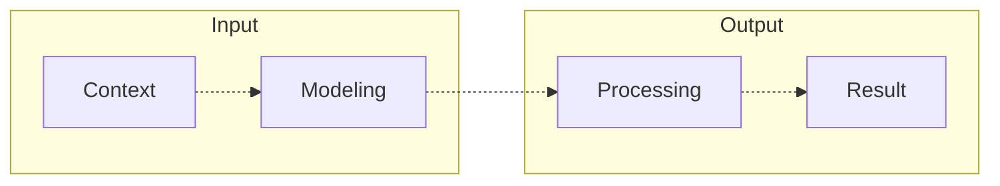

# Welcome 

[**🇧🇷 Versão em Português**](../../README.md)

Hello **Dev**, **Tech Recruiter** and **code enthusiast**!

I'm **Thiago Cajá**, a Software Developer working since **2007**, specializing in **.NET/C#** and full-stack ecosystems. I focus on secure architecture, sustainable code, and value delivery guided by high-level engineering principles.

Values that guide my journey: **Humility**, **Hard Work**, **Sincerity**, and **Dedication**.

This is my favorite "social network" by far! More code and less small talk 😄.

> [!IMPORTANT]
> **"Avoid the complex, prefer the simple and sophisticated"**

### The 4 Laws (Technical Governance)

I apply these laws as my **technical governance** foundation in every new project, ensuring that the bootstrap (the initial setup and base architecture definition) and the evolution of systems follow excellence standards from day one:

  
  
  
  

| Law | Strategic Commentary |
| :--- | :--- |
| **Hardening** | **Deep Security**: Data shielding and a *Deny-by-Default* posture. Security is not an "add-on", it's the foundation of any serious architecture. |
| **Resilience** | **Failure Management**: Implementation of the *Result Pattern* to treat errors as first-class values, avoiding generic exceptions and ensuring traceability. |
| **The Cascade** | **Fluid Code**: Application of *Top-Down* and *SLAP* so that the code can be read like a book, reducing the cognitive load for those who maintain it. |
| **Visual Excellence** | **Design as Code**: The aesthetics and precision of the interface are the final layer of trust. If the visual is neglected, the user projects that doubt onto security and performance. |

# 🚀 SDD: Spec Driven Development

> **"The specification drives the code, not the contrary."**

I seek to align my routine with an **AI-Native** flow based on **SDD**: the strategic specification (`SPEC.md`) precedes the first commit. I act as the architect who translates business needs into precise specifications, orchestrating **AI Agents** for high-fidelity delivery.

**The SDLC Cycle (5 Phases)**: My methodology follows a high-discipline cycle divided into 5 mandatory stages: **SPEC** (The Contract) → **PLAN** (The Strategy) → **CODE** (The Execution) → **TEST** (The Verification) → **END** (The Delivery).

- **Governance**: See how I apply this cycle in the [Governance of this Profile (GOVERNANCE.md)](GOVERNANCE.md).
- **Evidence**: Explore a [Spec Sample (SPEC_SAMPLE.md)](SPEC_SAMPLE.md) of a real background service.

**Vision of the Future**: I believe the modern developer's role is evolving towards writing precise specifications and technical curation. The future of development tends to be the art of defining, analyzing, and approving what **AI Agents** write, ensuring that every line of code faithfully reflects the business rules and project goals.

**Maturity and Adaptability**: I constantly monitor and study new methodologies and trends (such as spec-driven and AI-powered engineering), adapting them to my workflow to gain efficiency, while never discarding the traditional engineering foundations and processes that ensure the long-term solidity of a project.

- **Thought Flow**: Short methods, direct return, and narrative clarity.
- **GenAI Orchestration**: **AntiGravity**, **Claude Code**, and **Gemini** as hardening co-pilots.
- **Responsibility**: Human curation and critical sense in 100% of deliveries.

My life purpose is to help. I follow this path through IT, fixing and building things.

Recently I've been doing a "dump" of thoughts, writing on my [blog](https://thiagocaja.dev).

  
Learn more about my work methodology (SDD & Pipeline) ⬇️

## 💡 The Root Concept (Input → Process → Output)

 

I view development as a structured process of transforming data and contexts:

1. **Context Understanding**: What problem are we solving?

2. **Input Modeling**: Organization and structuring of information.

3. **Processing and Output Delivery**: Clarity, efficiency, and purpose.

 

---

## The Engineering Pipeline (01 to 08)

My value delivery is **guided** by a pipeline of 8 technical maturity phases:

**01. Foundation → 02. Security → 03. CI/CD → 04. RBAC → 05. UI/UX → 06. Domain → 07. Readiness → 08. Ops**

For technical details and my **Best Practices Guide** for each phase, check the [Governance Manual (PIPELINE.md)](PIPELINE.md)

 

### Maturity Summary

- **Foundation & Security**: Solid base, Orchestrated Startup, Observability, continuous review, and living documentation (README + onboarding from the first commit).

- **Automation & DX**: Predilection for single-entry utility scripts (`npm run dev`, `dev.sh`, etc.) that compose commands and work on both Linux and Windows, regardless of the project language. Centralized configuration via `.env`.

- **Identity & Design**: Focus on the end user with Visual Excellence and identity security.

- **Domain & Quality**: **SRP** (Single Responsibility Principle), Extension Methods, **SOLID**, **KISS** (Keep It Simple, Stupid), **YAGNI** (You Aren't Gonna Need It), **TDD** (Test-Driven Development) and **BDD** (Behavior-Driven Development).

- **Governance & Ops**: Performance (Cache, Pagination), data-driven action plans, and evolution traceability via **CHANGELOG** and **Release Notes**.

# Continuous Learning

I stay up to date with the content I believe in:

- [curso.dev](https://curso.dev) → Node.js/TypeScript ecosystem
- [balta.io](https://balta.io) → .NET universe
- [Anthropic](https://www.anthropic.com/learn) → AI courses

I am an eternal researcher. I don't pretend to know everything; I am driven by a constant dedication to learning and mastering what I don't know yet. I love sharing everything I discover.

I really do share 🙂! See tips to customize your profile ⬇️.

- [Profile Header](https://leviarista.github.io/github-profile-header-generator/)
- [Tech Shields](https://shields.io/)
- [Stats and custom cards](https://github.com/anuraghazra/github-readme-stats)
- [Trophies, PacMan, Snake and others](https://profile-readme-generator.com/)

**Can I help with something?** Just call.

# 📫 Contact

# 💻 Stack

### ⚙️ Backend

### 🖥️ Frontend

### 🗄️ Database

### ☁️ DevOps & Cloud

### 🔬 Quality & Testing

### 📐 Principles & Patterns

# 🧠 Generative AI

# 🛠️ Tools

### Apps & Productivity

### Terminal & Customization

# 📈 Stats

  

  

  

 

<picture>
  <source media="(prefers-color-scheme: dark)" srcset="https://raw.githubusercontent.com/thiagocajadev/thiagocajadev/output/pacman-contribution-graph-dark.svg">
  <source media="(prefers-color-scheme: light)" srcset="https://raw.githubusercontent.com/thiagocajadev/thiagocajadev/output/pacman-contribution-graph.svg">
  
</picture>

# 📌 Featured Projects

