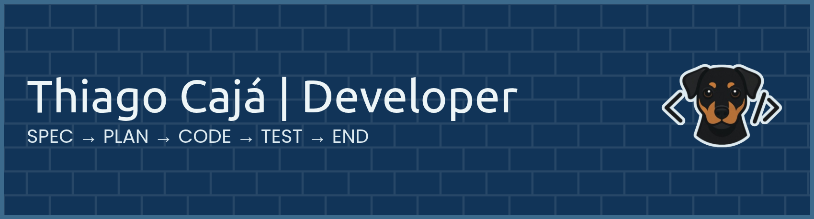

# Welcome 

[**🇧🇷 Versão em Português**](../../../README.md)

Hello **Dev**, **Tech Recruiter**, and **code enthusiast**!

I'm **Thiago Cajá**. I started in Technology in **2007**, initially working in technical support and server administration. It was by creating my first `.bat` scripts to automate repetitive tasks that I realized the value of efficiency and saving time. Since then, I have always strived for continuous improvement.

I explored various languages like Java, VB, and PHP before finding my home in the **.NET (C#)** ecosystem. Leading a support team (**Helpdesk**) taught me a life lesson: a problem is never just about the computer or the system. Code is simply a tool to solve real people's pain points and ensure processes flow smoothly.

Today, I work with a **modern stack** (**.NET**, **React**, **Docker**, **Postgres**), blending software engineering solidity with the agility of the **AI-Native** world. My goal is to build robust and secure systems, always aiming to simplify and facilitate the daily routines of developers and users.

I will never know all the answers, but I know how to research and search for alternatives. I would hardly consider myself a Senior or Specialist. I prefer to be a **Problem Solver**.

> [!IMPORTANT]
> **"Avoid the complex, prefer the simple and sophisticated"**

[](mailto:contato@thiagocaja.dev)

<details>
<summary><b> 📖 A bit more about me</b></summary>

### My values

Values that guide my journey: **Humility**, **Hard Work**, **Sincerity**, and **Dedication**.
<br>

This is my favorite "social network" by far! More code and less small talk 😄.
<br>

My life purpose is to help. I follow this path through IT, fixing and building things.
<br>

> **"In times of AI, practice EI (Emotional Intelligence)."**
>
> Artificial Intelligence is an incredible tool and amplifies you, but decisions should be made based on data, not guesswork.

Are you starting to use the SDD (Spec-Driven Development) methodology in your projects?
This guide can help you [specdrivenguide.org](https://specdrivenguide.org). Come join us!
<br>

Lately, I've been doing a "thought dump" on my [blog](https://thiagocaja.dev).

---

</details>

<details>
<summary><b> 🎨 UI/UX Design Thinking</b></summary>

### Visual architecture

> "Design the solution. It has to be easy to use."

Before any line of code, I think about the interface with **technical empathy**: focusing on productivity for those developing the frontend and real usability for those using the product.

I use **Design Thinking** to define what matters. I maintain the scope under a clear and functional hierarchy:

| Category        | Tokens and elements                                                       |
| :-------------- | :------------------------------------------------------------------------ |
| **Foundations** | Mobile/Desktop first · Colors · Typography · Spacings · Shadows · Borders |
| **Assets**      | Icons · Images · Videos · Audio · Documents                               |
| **Interface**   | Links · Buttons · Forms · Tables · Charts · Maps                          |

### Theme systems (Light & Dark)

Alternating between themes requires rigorous contrast control to avoid visual fatigue. I apply the concept of <b>surface + luminance</b> to ensure depth.

> Each element lives at a specific depth. Components that stay "inside" others move up a level and gain more <b>luminance</b> (perceived brightness), preserving the base color. This maintains natural depth in both light and dark modes.


### Styling

Attention to detail defines retention. I use modern tools (Tailwind CSS, Shadcn UI, Lucide) to create interfaces that look current and professional. Updated aesthetics are not just "eye candy"; they facilitate system adoption.

- Fluxes that guide the user intuitively toward the objective.
- Balance between visual density and whitespace.
- Standardized grid and spacings.
- Logical content division (steps, tabs, modals).

### Anti-patterns (UI/UX)

A bad experience is a cost for support and churn. Some points I treat as red flags:

- <b>Information overload</b>: Overloaded screens that confuse the focus.
- <b>Dense tables</b>: Long lists without pagination, filters, or search.
- <b>Visual pollution</b>: Excessively vibrant colors or lack of contrast.
- <b>Decorative animations</b>: Movements that do not communicate state or feedback.
- <b>Rigidity</b>: Use of fixed pixels where the layout should be fluid.
- <b>Platform bias</b>: Designing thinking only of one ecosystem (Apple/Android).

These are some details I consider important, I won't extend too much to avoid being tiring. If you want to talk about code, just continue to the next topic.

---

</details>

<details>
<summary><b> 👨🏻‍💻 Let's talk about code</b></summary>

### Narrative code

> "Good code is code that tells a story linearly."

It must follow a narrative, showing step-by-step what is happening. Applications are built to solve problems, so the code should reflect that.

Programming is the last stage. First, the process is defined. Then comes planning and which tasks to execute, reducing the chance of failure.

> **"Process alignment is fundamental to the success of a project."**

`PROCESS` → `PLANNING` → `TASKS` → `PROGRAMMING` → `TESTS` → `DELIVERY`

When I'm working on a project, I need to think about how it will be executed, maintained, and evolved. The next developer who works on it should understand the code without difficulty and rely on documentation that clarifies technical decisions. The best professionals are those who **generate value for the business and people**.
<br>

```js
// ✅ Narrative Code
// Orchestrator at the top, details below (Step-down Rule), visual density, and expressive names.

// Simplified example. The code tells the story without needing comments.

await completeSale(123);

async function completeSale(orderId) {
  const orderDetails = findOrder(orderId);
  if (invalidOrder(orderDetails)) return;

  const invoiceIssued = issueInvoice(orderDetails);
  return invoiceIssued;
}

// Function details always below the main flow

function findOrder(orderId) {
  const orderDetails = database.findByCode(orderId);
  return orderDetails;
}

function invalidOrder(orderDetails) {
  if (orderDetails === null || orderDetails.items.length === 0) return true;

  if (orderDetails.customer.overdue) return notifyOverdue(orderDetails);

  return false;
}

function issueInvoice(orderDetails) {
  applyDiscounts(orderDetails);

  const invoice = saveOrder(orderDetails);
  return invoice;
}
```

The focus of the code above is not the application itself, but rather to demonstrate narrative code. In the next topic, I will talk about **anti-patterns** and **patterns** that I strive to apply in projects.

> 👨🏻‍💻 I've gathered my best code styling practices in a dedicated repository. If you'd like to check it out, visit [code-style](https://github.com/thiagocajadev/code-style)

---

</details>

<details>
<summary><b>⚠️ Anti-Patterns and Patterns</b></summary>

### Anti-Pattern: Spaghetti Code

I believe that no one knows or knows everything. We are human beings and this is a normal characteristic. However, one thing is certain: avoid what can cause problems.

```js
// ❌ Spaghetti version of the previous example, with code all mixed up and without concepts.

completeSale(123);

function completeSale(x) {
  let result;
  // bad names
  let p = findOrder(x);

  if (p != null) {
    if (p.items && p.items.length > 0) {
      if (!p.c.overdue) {
        // starts doing a bunch of things in the middle
        if (p.total > 100) {
          p.discount = 10;
        } else {
          p.discount = 0;
        }

        apply(p);

        function apply(p) {
          if (p.discount) {
            p.total = p.total - p.discount;
          }
        }

        let saved = saveOrder(p);

        if (saved) {
          result = saved;

          // random logic in the middle
          if (Math.random() > 0.5) {
            console.log("Random log");
          } else {
            console.warn("Another log");
          }
        } else {
          result = null;
        }
      } else {
        // more nested logic with function in the middle
        notify(orderDetails);
        result = false;

        // bad names and mixed language
        function notify(p) {
          console.log("overdue customer", p?.customer?.name);
          return true;
        }
      }
    } else {
      result = undefined;
    }
  } else {
    result = null;
  }

  // dead/confusing code
  if (false) {
    console.log("never executes");
  }

  return result;

  function save(p) {
    if (!p) return;
    if (p.total < 0) return null;
    return { ...p, saved: true };
  }
}
```

Well, there's no way to watch this torture. That's why it's good to avoid this kind of code as much as possible. I know that in times past we have all written bad code, but today with the knowledge available, it's possible to do better.

### 🚫 ANTI-PATTERNS

Key points:

1. Chaotic flow control
2. Mixed responsibilities
3. Lack of clear data and return contract

#### Naming and readability

- Names without meaning (`x`, `p`, `c`, `apply`)
- Mixed languages
- Lack of explicit intention in identifiers

#### Flow control

- Excessive nesting (`if` inside `if`)
- Lack of early return
- Scattered conditional logic that is hard to follow
- Use of `!=` (implicit coercion)

#### Return and contract

- Multiple return types (`null`, `undefined`, `false`, object)
- Lack of clear return contract
- Flow based on `null`/`undefined`

#### Structure and design

- Function with multiple responsibilities
- Business rules mixed with persistence and logging
- Functions declared inside others unnecessarily (`apply`, `notify`, `save`)
- Unused function (dead code)
- Unreachable code (`if (false)`)

#### State and mutability

- Shared mutable variable (`result`)
- Direct object mutation (`p.total`, `p.discount`)
- Strong structural coupling (`p.c.overdue`)

#### Side effects and unpredictability

- Side effects in the middle of logic (`console.log`, `console.warn`)
- Non-deterministic behavior (`Math.random()`)

---

Below are some more common anti-patterns in real projects:

#### Data modeling and contract

- Pure boolean (`true/false`) instead of structured Result
- Multiple return types (null / undefined / false / object)
- Inflated “MegaResult” with meta/status
- Empty fields in the envelope (`meta: {}`, `data: {}`)
- Mixing domain with transport (ex: Result + statusCode)
- `meta` as generic dump
- Return with anonymous object without clear contract

#### Incorrectly coupled UI / Frontend

- Direct fetch in the component
- Scattered API (without `apiClient`)
- Logic inside `useEffect`
- Data transformation inside the UI
- `try/catch` scattered in the UI
- Result in the UI state
- Complex inline return (direct JSX without composition)
- Multiple sources of truth in state

#### Code design

- Overly generic functions (`handle`, `process`, etc.)
- Functions with multiple responsibilities
- Heavy ViewModel / unnecessary layer
- Redundant Action (simple CRUD without value)
- Structure duplication between layers
- Cache coupled to the core
- Overengineering (abstraction without necessity)

#### Flow and control

- Exceptions as normal flow
- Chaotic conditional logic
- Lack of early return
- Dead / unreachable code

#### Consistency and clarity

- Names without intention
- Mixed languages
- Internal structures exposed (high coupling)
- Side effects mixed with business rules

---

### ✅ Patterns: Clean Code

Conventions, patterns, and principles are always better in the long run. If they were invented, it's because they make sense and solve real problems.

```js
// ✅ Narrative Code
// Orchestrator at the top, details below (Step-down Rule), visual density, and expressive names.

await completeSale(123);

async function completeSale(orderId) {
  const orderDetails = findOrder(orderId);
  if (invalidOrder(orderDetails)) return;

  const invoiceIssued = issueInvoice(orderDetails);
  return invoiceIssued;
}

function findOrder(orderId) {
  const orderDetails = database.findByCode(orderId);
  return orderDetails;
}

function invalidOrder(orderDetails) {
  if (orderDetails === null || orderDetails.items.length === 0) return true;
  if (orderDetails.customer.overdue) return notifyOverdue(orderDetails);

  return false;
}

function issueInvoice(orderDetails) {
  applyDiscounts(orderDetails);

  const invoice = saveOrder(orderDetails);
  return invoice;
}
```

Practically the same code, easier to understand and maintain. Following methodologies and "alphabet soup" like DDD, TDD, BDD, SOLID, SRP, SOLID, YAGNI, etc... is important, but it's not the main focus. The main focus is writing clean and legible code.

### ☑️ Patterns

Key points:

1. Simple and predictable flow
2. Separation of responsibilities
3. Clear and consistent contracts

#### Naming and readability

- Descriptive names with clear intention (`order`, `customer`, `calculateDiscount`)
- Consistency of language in the code
- Self-explanatory functions and variables

#### Flow control

- Use of early return to simplify reading
- Reduced nesting (flat code)
- Explicit and predictable conditions (`===`, `!==`)
- Linear and easy-to-follow flow

#### Return and contract

- Consistent return (always the same format)
- Use of well-defined Result/DTO
- Avoid `null`/`undefined` as flow control
- Explicit contracts between functions

#### Structure and design

- Functions with single responsibility (SRP)
- Clear separation of responsibilities (domain, persistence, side effects)
- Small, reusable, and testable functions
- Removal of dead code
- Function declaration at the appropriate level (outside when possible)

#### State and mutability

- Preference for immutability
- Avoid direct mutation of shared objects
- Variables with minimum scope and preferably `const`
- Access through clear interfaces (low coupling)

#### Side effects and unpredictability

- Isolated side effects (logs, IO, etc.)
- Pure functions whenever possible
- Deterministic behavior (no randomness in the core)

#### Data modeling and contract

- Structured and typed Result
- Consistent and predictable return
- Separation between domain and transport (ex: DTO ≠ HTTP)
- Clear contracts between layers
- Lean structures (no empty fields)
- Meaningful data (no generic `meta`)

#### Well-structured UI / Frontend

- Use of centralized `apiClient`
- Fetch outside the component (services/hooks)
- `useEffect` only for real effects (not business rules)
- UI focused on rendering
- Centralized error handling
- State with a single source of truth
- Small and composite components

#### Code design

- Specific functions named by intention
- Clear separation of layers
- Simplicity before abstraction
- Reuse without coupling
- Consistent structure between layers
- Cache decoupled from core

#### Flow and control

- Use of guard clauses (early return)
- Predictable and linear flow
- Explicit error handling
- Elimination of dead code

#### Consistency and clarity

- Defined naming pattern
- Cohesive and legible code
- Low coupling between structures
- Isolated and explicit side effects

That's it! Now with a broader perspective and a focus on project and people management, let's talk about governance in the next topic.

---

</details>

<details>
<summary><b>🏛️ Governance</b></summary>

### Technical Governance

Governing means having control over the project and ensuring its lifecycle. Tools like indicators and monitoring provide the basis for decision-making, directing the ideal actions at the right time.

If I have the vision that something has started to degrade and needs more resources, I can adjust it before there is an impact.

To have governance, we apply laws. The ones I consider fundamental and strive to apply:

<p align="left">   </p>

| Law                   | Strategic Commentary                                                 |
| :-------------------- | :------------------------------------------------------------------- |
| **Hardening**         | **Deep Security**: Data shielding and a _Deny-by-Default_ posture.   |
| **Resilience**        | **Failure Management**: Centralizes and standardizes error handling. |
| **The Cascade**       | **Narrative Code**: Code executes the process step-by-step linearly. |
| **Visual Excellence** | **Intuitive Design**: Beautiful and easy-to-use interfaces.          |

**Going deeper into philosophy, convictions, and standards (RFC/ISO) that underpin decision-making**: [Governance Details](GOVERNANCE-DETAILS.md)

With an understanding of governance, we move on to managing the **Software Development Life Cycle (SDLC)**.

### Software Development Life Cycle - SDLC

For healthy development, we need to distinguish between two moments:

**Project: The Birth**
It is an effort with a beginning, middle, and end. The focus is to transform an idea into a functional product. A good project is born foreseeing sustainability, avoiding that today's haste becomes tomorrow's technical debt and excessive cost.

**Process: Life Goes On**
It is a cyclic and permanent flow. While the project delivers the solution, the process ensures that the product continues to evolve and generate value. It is the routine that keeps the software updated, secure, and efficient for both the investor and the user.

Below I list 8 steps I consider fundamental for healthy development:

`FOUNDATION` → `SECURITY` → `CONTINUOUS INTEGRATION` → `ACCESS CONTROL` → `APP INTERFACE` → `DOMAIN` → `PRODUCTION` → `OPERATIONS`

**Explaining each step in detail**: [SDLC Trail Details](SDLC-DETAILS.md)

For each stage of this cycle, it is ideal to define a methodology as a guide. Below I talk about the choice of **Spec-Driven Development (SDD)**.

### Spec-Driven Development - SDD

> **"The specification drives the code, not the contrary."**

Now with a view of processes, there's nothing better than defining the work methodology. I see that the market is moving towards an **AI-Native** workflow. **SDD** - Spec-Driven Development, is a promising path for the Developer to act in partnership with AI Agents. Below are the main phases of this approach:

**5-Phase Pipeline**:
`SPECIFICATION` → `PLANNING` → `PROGRAMMING` → `TESTS` → `DELIVERY`

- **Explaining each phase and how to apply it**: [SDD Details](SDD-DETAILS.md)
- **An example of a Specification**: [Spec Example](SPEC-EXAMPLE.md)

Spec-Driven is a type of **Harnessing**, which uses specification concepts for AI-Native applications. A good developer follows the evolution of methodologies and additions. I always think about adding improvements to my workflow, multiplying them with other Devs.

---

</details>

<details>
<summary><b>💻 My Stack</b></summary>

### Backend & Core


### Frontend & UI


### Database & Cloud


### Patterns & Quality


---

</details>

<details>
<summary><b>🤖 AIs & Tools</b></summary>

### Generative AI

[](https://deepmind.google/technologies/gemini/)
[](https://anthropic.com/claude)
[](https://openai.com/chatgpt)
[](https://www.deepseek.com/)

### Dev Tools & Terminal

[](https://code.visualstudio.com/)
[](https://www.jetbrains.com/rider/)
[](https://starship.rs/)
[](https://www.docker.com/products/docker-desktop/)

---

</details>

<details>
<summary><b>📚 Learning & Tips</b></summary>

### Continuous Learning

- [curso.dev](https://curso.dev) → JavaScript, Next.js, Postgres, React
- [balta.io](https://balta.io) → .NET Universe
- [Anthropic](https://www.anthropic.com/learn) → AI Courses

### Tips for your GitHub Profile

- [Profile Header](https://leviarista.github.io/github-profile-header-generator/)
- [Technology Shields](https://shields.io/)
- [Statistics and cards](https://github.com/anuraghazra/github-readme-stats)
- [Trophies & Games](https://profile-readme-generator.com/)

</details>

---

# 📫 Contact

<p align="left">
  <a href="mailto:contato@thiagocaja.dev"></a>
  <a href="https://linkedin.com/in/thiagocajadev"></a>
</p>

# 📈 Stats

<div>
  
</div>
<br>

<span>
  
</span>
<span>
  
</span>
<br><br>

<picture>
  <source media="(prefers-color-scheme: dark)" srcset="https://raw.githubusercontent.com/thiagocajadev/thiagocajadev/output/pacman-contribution-graph-dark.svg">
  <source media="(prefers-color-scheme: light)" srcset="https://raw.githubusercontent.com/thiagocajadev/thiagocajadev/output/pacman-contribution-graph.svg">
  
</picture>

# 📌 Featured Projects

[](https://github.com/thiagocajadev/code-style)
[](https://github.com/thiagocajadev/sdg-agents-cli)
[](https://github.com/thiagocajadev/match-themes)
[](https://github.com/thiagocajadev/PayCheckBR)
[](https://github.com/thiagocajadev/clone-tabnews)
[](https://github.com/thiagocajadev/terminal-bash-one-dark-starship-profile)
[](https://github.com/thiagocajadev/BlazorChallengeIBGEv2)
[](https://github.com/thiagocajadev/FleetMGMT)
