# SDD Deep-Flow: Por Dentro do Ciclo

Este guia detalha os sub-passos internos que um **Agente de IA compatível com SDD** executa em cada fase do ciclo de trabalho.

Obs\*: Nada impede que o time de desenvolvimento apenas siga o fluxo sem agents, é uma escolha estratégica.

Deixo aqui um convite para você conhecer o guia web, com mais conteúdo e representações visuais [specdrivenguide.org](https://specdrivenguide.org)

## Visualizando o Deep-Flow

O diagrama abaixo mostra as transições, as barreiras de decisão e os loops que garantem a integridade arquitetural.

```mermaid
graph TD
    Trigger((Requisição)) --> SPEC

    subgraph SPEC [1. SPEC: O Contrato]
        S1[Classificação da Intenção] --> S2[Definição do Objetivo]
        S2 --> S3[Domínio e Contratos]
        S3 --> S4[Checklist de Verificação]
        S4 --> S5{Barreira de Aprovação}
    end

    S5 -- Aprovado --> PLAN
    S5 -- Negado --> SPEC

    subgraph PLAN [2. PLAN: A Estratégia]
        P1[Decomposição de Tarefas] --> P2[Sequenciamento Lógico]
        P2 --> P3[Tagging de Esforço]
        P3 --> P4[Divisão de Sub-tarefas]
        P4 --> P5[Sync com Backlog]
        P5 --> P6{Barreira de Aprovação}
    end

    P6 -- Aprovado --> CODE
    P6 -- Negado --> PLAN

    subgraph CODE [3. CODE: A Execução]
        C1[Carga de Contexto] --> C2[Portão Narrativo]
        C2 --> C3[Aderência ao Plano]
        C3 --> C4[Superfície de Bloqueios]
    end

    C4 -- Loop sem Progresso 3x --> Stop
    C4 --> TEST

    subgraph TEST [4. TEST: A Verificação]
        T1[Verificação do Checklist] --> T2[Prova de Regressão]
        T2 --> T3{Loop de Correção}
        T3 -- Sucesso --> T4[Lint Fix]
        T4 --> T5[Report de Status]
    end

    T3 -- Falha (Máx 3x) --> CODE
    T3 -- Bloqueado --> Stop((PARAR e Reportar))

    T5 --> END

    subgraph END [5. END: A Entrega]
        E1[Resumo da Tarefa] --> E2[CHANGELOG]
        E2 --> E3[Sync com Backlog]
        E3 --> E4[Contexto e Aprendizados]
        E4 --> E5[Lint Final]
        E5 --> E6[Sugestão de Commit]
        E6 --> E7[Próximos Passos]
    end

    E7 --> Done((Concluído))

    style S5 fill:#f96,stroke:#333
    style P6 fill:#f96,stroke:#333
    style T3 fill:#f96,stroke:#333
    style C4 fill:#ffa,stroke:#333
    style Stop fill:#f66,stroke:#333
```

Clique para visualizar o Deep-Flow interno

---

## Detalhamento de Cada Fase

### 1. Fase: SPEC

> **Papel: Planejamento**

O agente define **o que** construir antes de pensar em **como**.

- **Identificação da Intenção**: Classificação como `feat:`, `fix:` ou `docs:`.
- **Objetivo**: Uma frase técnica de "Norte Verdadeiro".
- **Checklist de Verificação**: Até 5 critérios binários usados para validar a entrega final.
- **Portão de Aprovação**: A execução **deve parar** aqui para **verificação do Desenvolvedor**.

### 2. Fase: PLAN

> **Papel: Planejamento**

O agente transforma a spec em tarefas menores, com estimativas de esforço.

- **Tarefas**: Padrão: `Verbo de Ação + Objeto`.
- **Tagging de Esforço**: Tarefas classificadas por tamanho — `[P]` (pequena), `[M]` (média), `[G]` (grande).
- **Divisão de Sub-tarefas**: Qualquer tarefa `[G]` é decomposta em passos menores (`1.1`, `1.2`).
- **Portão de Aprovação**: A execução **deve parar** aqui para garantir que a estratégia está sólida.

### 3. Fase: CODE

> **Papel: Codificador**

Execução seguindo os padrões arquiteturais.

- **Barreira Narrativa**: Auto-verificação de **Stepdown Rule**, **SLA** e **Lexical Scoping**.
- **Aderência ao Plano**: Nenhuma feature ou refatoração fora do escopo (YAGNI).
- **Superfície de Bloqueios**: O agente sinaliza problemas imediatamente em vez de contorná-los.
- **Circuit Breaker**: Se o mesmo erro se repetir 3 vezes, ou nenhum progresso físico (escrita de arquivos, comandos) for feito em 3 turnos consecutivos, o agente **para e reporta** em vez de continuar em loop.

### 4. Fase: TEST

> **Papel: Codificador**

Verificação comparando com o checklist original da Spec.

- **Prova de Regressão**: Para bugs, o agente deve provar que a correção funciona sem quebrar a lógica existente.
- **Loop de Correção**: Mecanismo de resiliência que permite até **3 tentativas de refatoração** se os testes falharem. Na terceira falha, o Circuit Breaker é acionado — o agente para e reporta.
- **Lint Fix**: Resolução automática de problemas na estilização do código antes de reportar sucesso.

### 5. Fase: END

> **Papel: Planejamento**

Fechando o ciclo e garantindo o acompanhamento do projeto.

- **Sync de Artefatos**: Atualizações em `tasks.md` (status DONE) e `context.md` (próximo objetivo).
- **Engineering Insights**: O agente registra descobertas de pesquisa, padrões de retrabalho e lições aprendidas em `context.md ## Engineering Insights`. Entradas obsoletas são removidas, mantendo o arquivo enxuto entre sessões.
- **Changelog**: Histórico consistente seguindo o padrão [Keep a Changelog](https://keepachangelog.com/).
- **Commit Semântico**: Proposta de mensagem de commit que reflete a intenção e o escopo reais da mudança.

---

> [!TIP]
> Esse deep-flow é um modelo interno de referência para o agente. Use-o para entender os **por ques**, **pra que** e **pra onde** o agente verifica em cada barreia.
