# SDD Deep-Flow: Por Dentro do Ciclo de Trabalho

Este guia explica como um assistente de IA configurado para trabalhar com SDD (Desenvolvimento Guiado por Especificação) organiza o pensamento em cada fase do projeto. O objetivo é garantir que o trabalho seja transparente, seguro e fácil de acompanhar.

Obs\*: Nada impede que o time de desenvolvimento apenas siga o fluxo sem agents, é uma escolha estratégica.

Deixo aqui um convite para você conhecer o guia web, com mais conteúdo e representações visuais [specdrivenguide.org](https://specdrivenguide.org)

## Visualizando o Fluxo (Deep-Flow)

O diagrama abaixo mostra as transições entre as fases, onde estão as decisões mais importantes e como garantimos que o sistema continue íntegro.

```mermaid
graph TD
    Trigger((Requisição)) --> SPEC

    subgraph SPEC [1. SPEC: O Contrato]
        S1[Classificação da Intenção] --> S2[Definição do Objetivo]
        S2 --> S3[Domínio e Contratos]
        S3 --> S4[Checklist de Verificação]
        S4 --> S5{Barreira de Aprovação}
    end

    S5 -- Aprovado --> PLAN
    S5 -- Negado --> SPEC

    subgraph PLAN [2. PLAN: A Estratégia]
        P1[Decomposição de Tarefas] --> P2[Sequenciamento Lógico]
        P2 --> P3[Tagging de Esforço]
        P3 --> P4[Divisão de Sub-tarefas]
        P4 --> P5[Sync com Backlog]
        P5 --> P6{Barreira de Aprovação}
    end

    P6 -- Aprovado --> CODE
    P6 -- Negado --> PLAN

    subgraph CODE [3. CODE: A Execução]
        C1[Carga de Contexto] --> C2[Barreira Narrativo]
        C2 --> C3[Aderência ao Plano]
        C3 --> C4[Superfície de Bloqueios]
    end

    C4 -- Loop sem Progresso 3x --> Stop
    C4 --> TEST

    subgraph TEST [4. TEST: A Verificação]
        T1[Verificação do Checklist] --> T2[Prova de Regressão]
        T2 --> T3{Loop de Correção}
        T3 -- Sucesso --> T4[Lint Fix]
        T4 --> T5[Report de Status]
    end

    T3 -- Falha (Máx 3 tentativas) --> CODE
    T3 -- Bloqueado --> Stop((PARAR e Reportar))

    T5 --> END

    subgraph END [5. END: A Entrega]
        E1[Resumo da Entrega] --> E2[Registro de Mudanças]
        E2 --> E3[Ajustar Backlog]
        E3 --> E4[Lições Aprendidas]
        E4 --> E5["Verificação Final (Lint)"]
        E5 --> E6[Sugerir Commit]
        E6 --> E7[Próximos Passos]
    end

    E7 --> Done(("Concluído"))

    style S5 fill:#f96,stroke:#333
    style P6 fill:#f96,stroke:#333
    style T3 fill:#f96,stroke:#333
    style C4 fill:#ffa,stroke:#333
    style Stop fill:#f66,stroke:#333
```

Clique para ver o fluxo interno detalhado

---

## O que acontece em cada fase?

### 1. Fase: SPEC (O Contrato)

> **Papel: Planejamento**

O agente define **o que** deve ser construído antes de se preocupar com o código. É o momento de alinhar as expectativas.

- **Entender a Intenção**: Identificamos se é uma nova função (`feat`), uma correção (`fix`) ou melhoria de documentação (`docs`).
- **Objetivo**: Criamos uma frase simples que serve como o nosso "Norte".
- **Lista de Verificação**: Criamos até 5 pontos claros para confirmar se a entrega foi bem-feita.
- **Barreira de Aprovação (Gate)**: O trabalho **para aqui** e só continua depois que você revisar e der o "ok".

### 2. Fase: PLAN (Planejamento)

> **Papel: Planejamento**

O agente transforma a spec em tarefas menores, com estimativas de esforço.

- **Divisão**: Quebramos o trabalho em tarefas curtas (Ação + Objeto).
- **Esforço**: Classificamos cada passo pelo tamanho (Pequeno, Médio ou Grande).
- **Detalhamento**: Se uma tarefa for muito grande, ela é dividida em subpassos menores.
- **Barreira de Aprovação**: Paramos novamente para garantir que a estratégia faz sentido para você.

### 3. Fase: CODE (A Execução)

É a hora de colocar a mão no código, seguindo boas práticas de organização.

- **Código Narrativor**: Seguimos regras de escrita que tornam o código fácil de ler, como a **Regra de escrita linear (Stepdown Rule)**.
- **Foco no Plano**: Não criamos nada que não tenha sido planejado (seguindo o princípio YAGNI: "você não vai precisar disso agora").
- **Sinalização de Problemas**: Se algo travar, o agente avisa na hora em vez de tentar "dar um jeitinho".
- **Disjuntor de Segurança (Circuit Breaker)**: Se o mesmo erro acontecer 3 vezes seguidas ou se não houver progresso real, o agente **para e pede ajuda** para não gastar recursos à toa.

### 4. Fase: TEST (A Verificação)

O agente confere se tudo o que foi feito bate com a lista que criamos lá na fase SPEC.

- **Prova de Segurança**: Para cada correção, provamos que o erro sumiu sem criar problemas novos.
- **Ciclo de Ajustes**: O sistema permite até 3 tentativas de melhoria se os testes falharem. Depois disso, ele pede uma intervenção humana.
- **Limpeza**: Antes de terminar, o código passa por uma revisão automática de estilo e formatação.

### 5. Fase: END

> **Papel: Planejamento**

Fechando o ciclo e garantindo o acompanhamento do projeto.

- **Sync de Artefatos**: Atualizações em `tasks.md` (status DONE) e `context.md` (próximo objetivo).
- **Engineering Insights**: O agente registra descobertas de pesquisa, padrões de retrabalho e lições aprendidas em `context.md ## Engineering Insights`. Entradas obsoletas são removidas, mantendo o arquivo enxuto entre sessões.
- **Changelog**: Histórico consistente seguindo o padrão [Keep a Changelog](https://keepachangelog.com/).
- **Commit Semântico**: Proposta de mensagem de commit que reflete a intenção e o escopo reais da mudança.

---

> [!TIP]
> Esse fluxo interno é o mapa que guia o agente. Conhecer esses passos ajuda você a entender **por que** ele faz certas perguntas e **onde** ele verifica a qualidade do trabalho.
